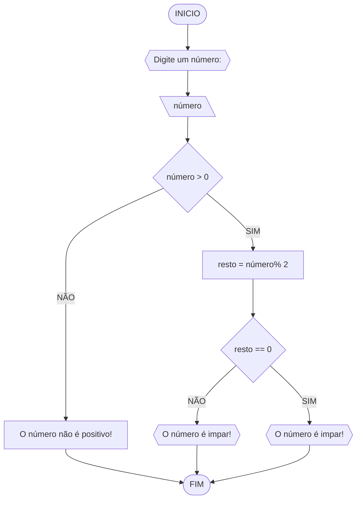

# UNIFOR
**Nome**: Ikaro Chaves
**Disciplina**: Raciocínio Lógico Algorítmico

## Exercício 3
### Fluxograma



```
### Pseudocódigo
```
1  ALGORITIMO verifica_par_impar
2  DECLARE numero, resto NUMERICO
3  ESCREVA "digite um numero"
4  LEIA numero
5  SE numero > 0 ENTAO
6		resto = numero % 
7		SE resto == 0 ENTAO
8			ESCREVA "O numero é par"
9		SENAO
10			ESCREVA "O número é impar"
11  SENAO
12		ESCREVA "O número é postivo!"
13  FIM_ALGORITIMO
```


