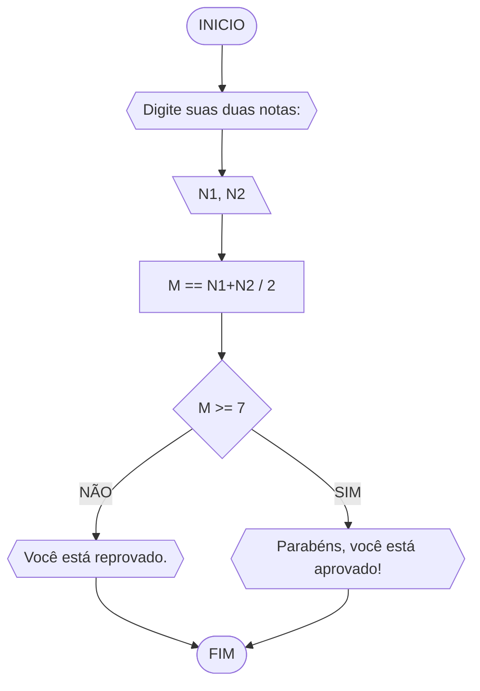
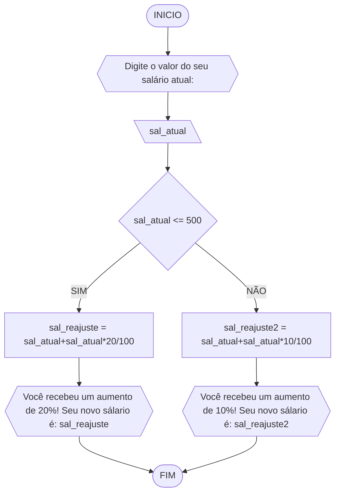
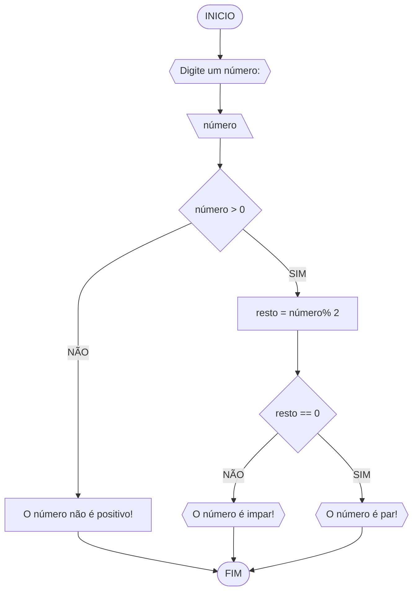
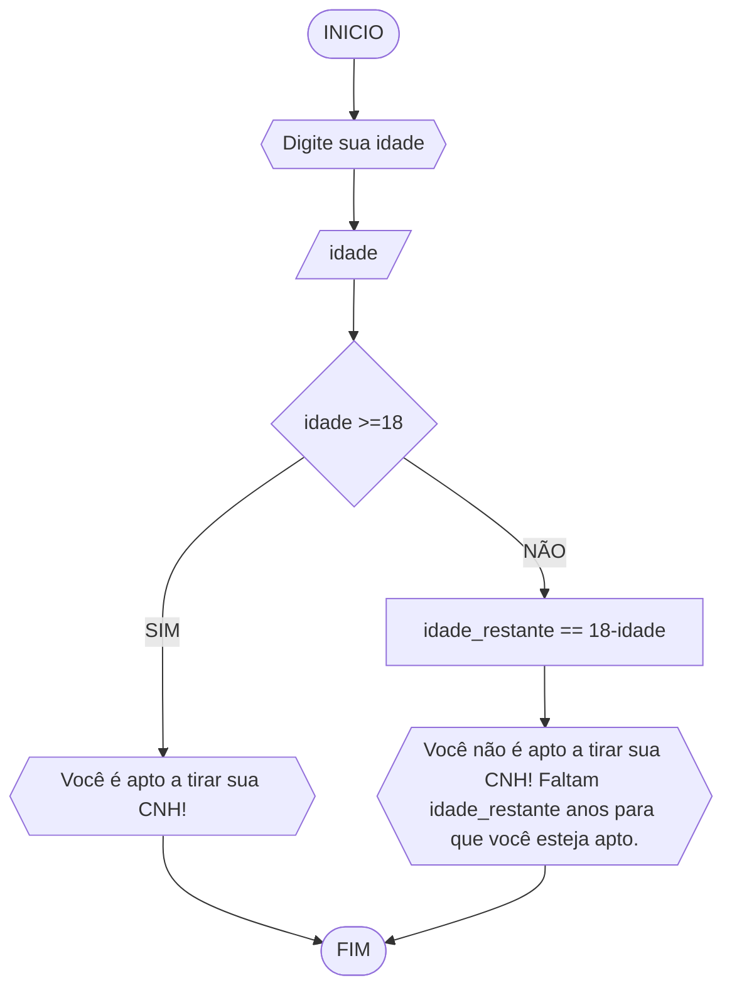

# UNIFOR
**Nome**: Ikaro Chaves <br>
**Disciplina**: Raciocínio Lógico Algorítmico

## Lista 1 
### Exercício 1
Represente, em fluxograma e pseudocódigo, um algoritmo para calcular a média aritmética entre duas notas de um aluno e mostrar sua situação, que pode ser aprovado ou reprovado;
#### Fluxograma


#### Pseudocódigo 1
```
1  ALGORITIMO media_nota
2  DECLARE N1, N2, M
3  INICIO
4  ESCREVA "Digite suas duas notas:"
5  LEIA N1, N2
6  CALCULE M = N1+N2 / 2
7  SE M >= 7 ENTAO
8    ESCREVA "Parabéns, você está aprovado!"
9  SENAO
10    ESCREVA "Você está reprovado."
11 FIM_SE
12 FIM_ALGORITIMO

```
### Exercício 2
Represente, em fluxograma e pseudocódigo, um algoritmo para calcular o novo salário de um funcionário. Sabe-se que os funcionários que recebem atualmente salário de até R$ 500 terão aumento de 20%; os demais terão aumento de 10%.


#### Pseudocódigo 2

```
1  ALGORITIMO novo_salario
2  DECLARE sal_atual, sal_reajuste, sal_reajuste2
3  INICIO
4  ESCREVA "Digite o valor do seu salário atual:"
5  LEIA sal_atual
6  SE sal_atual >= 500 ENTAO
7	 CALCULE sal_reajuste = sal_atual+sal_atual*20/100
8	 ESCREVA "Você recebeu um aumento de 20%! Seu novo sálario é: sal_reajuste"
9  SENAO
10	 CALCULE sal_reajuste2 = sal_atual+sal_atual*10/100
11	 ESCREVA "Você recebeu um aumento de 10%! Seu novo sálario é: sal_reajuste2"
12  FIM_SE
13  FIM_ALGORITIMO

```
### Exercício 3


#### Pseudocódigo
```
1  ALGORITIMO verifica_par_impar
2  DECLARE numero, resto NUMERICO
3  ESCREVA "digite um numero"
4  LEIA numero
5  SE numero > 0 ENTAO
6		resto = numero % 
7		SE resto == 0 ENTAO
8			ESCREVA "O numero é par"
9		SENAO
10			ESCREVA "O número é impar"
11  SENAO
12		ESCREVA "O número é postivo!"
13  FIM_ALGORITIMO
```
### Exercício 4
Represente, em fluxograma e pseudocódigo, um algoritmo que, a partir da idade do candidato(a), determinar se pode ou não tirar a CNH. Caso não atender a restrição de idade, calcular quantos anos faltam para o candidato estar apto.


#### Pseudocódigo 4

```
1  ALGORITIMO CNH_IDADE
2  DECLARE idade, idade_restante
3  INICIO
4  ESCREVA "Digite sua idade"
5  LEIA idade
6  SE idade >=18 ENTAO
7	 ESCREVA "Você é apto a tirar sua CNH!"
8  SENAO
9	 CALCULE idade_restante == 18-idade
10	 ESCREVA "Você não é apto a tirar sua CNH! Faltam idade_restante anos para que você esteja apto."
11  FIM_SE
12  FIM_ALGORITIMO
```
