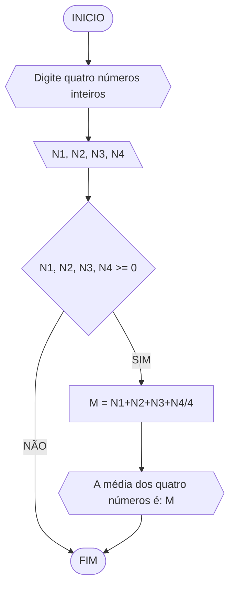
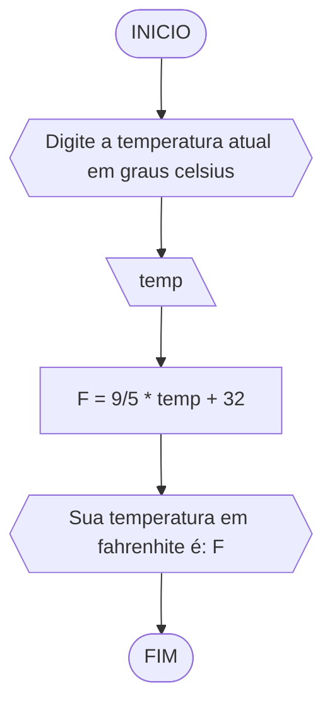
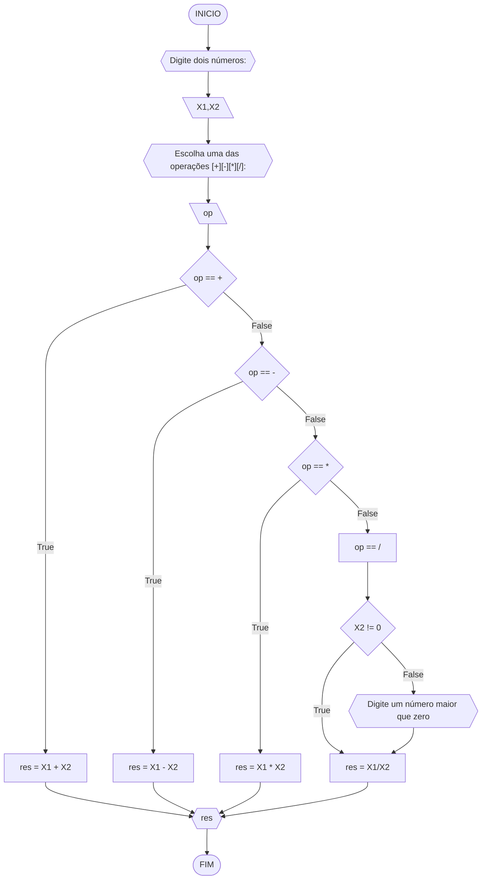
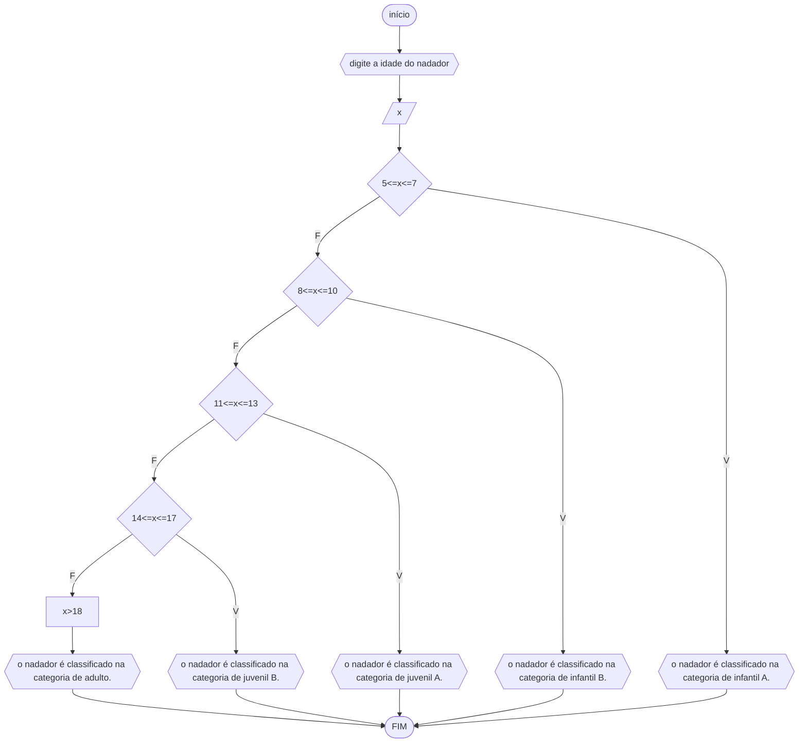

# UNIFOR
**Nome**: Ikaro Chaves <br>
**Disciplina**: Raciocínio Lógico Algorítmico

## Lista 2 
### Exercício 1
Calcule a média de quatro números inteiros dados

#### Fluxograma 1

#### Pseudocódigo 1

```
1  ALGORITIMO media_numeros
2  DECLARE N1, N2, N3, N4, M
3  INICIO
4  ESCREVA "Digite quatro números inteiros"
5  LEIA N1, N2, N3, N4
6  SE N1, N2, N3, N4 >= 0 ENTAO
7	  CALCULE M = N1+N2+N3+N4/4
8	  ESCREVA "A média dos quatro números é:" 
9  SENAO
10	  ESCREVA "Digite quatro números inteiros"
11  FIM_ALGORITIMO
  
```
#### Teste de mesa 1


|N!|N2|N3|N4|soma| média |
|-|-|-|-|-|-|
|6|6|9|7|28|7
|7|6|4|3|20|5
|3|6|9|6|24|6

### Exercício 2
Leia uma temperatura dada em Celsius (C) e imprima o equivalente em Fahrenheit (F). (Fórmula de conversão: F = (9/5) * C + 32)

#### Fluxograma 2

#### Pseudocódigo 2

```
1  ALGORITIMO calcular_temp
2  DECLARE temp, F
3  INICIO
4  ESCREVA "Digite a temperatura atual em graus celsius"
5  LEIA temp
6	 CALCULE F = 9/5 * temp + 32
7	 ESCREVA "Sua temperatura em fahrenhite é: F" 
8  FIM_ALGORITIMO
  
```

#### Teste de mesa 2

|Celsius (C°)|calculo|Fahrenheit (F°)|
|-|-|-|
|75|(9/5*75)+32|135|
|85|(9/5*85)+32|153|
|55|(9/5*55)+32|99|

### Exercício 3
Receba dois números reais e um operador e efetue a operação correspondente com os
valores recebidos (operandos). O algoritmo deve retornar o resultado da operação

#### Fluxograma 3


#### Pseudocódigo 3

```
1  ALGORITIMO calculadora
2  DECLARE X1, X2
3  op: caractere
4  INICIO
5  ESCREVA "Digite dois números:"
6  LEIA X1, X2
7	 ESCREVA "Escolha uma das operações [+][-][*][/]:"
8	 LEIA op 
9     CASO op == +
10    CALCULE res = X1 + X2
11      CASO op == -
12       CALCULE res = X1 - X2
13         CASO op == *
14         CALCULE res = X1 * X2
15           SENÃO OP == /
16             SE X2!= 0
17             CALCULE res = X1 / X2
18             SENÃO ESCREVA"Digite um número maior que zero"
19             CALCULE res =X1 / X2   
20  FIM_SE
21  FIM_ESCOLHA
22  FIM_ALGORITMO
  
```
#### Teste de mesa 3

| N1 | N2 | op | op == + | op == - | op == * | op == / | N2 != 0 | Saída                           |
|----|----|----|---------|---------|---------|---------|:-------:|---------------------------------|
| 10 | 1  | +  | True    | False   | False   | False   |    -    | 11                              |
| 11 | 2  | -  | False   | True    | False   | False   |    -    | 9                               |
| 12 | 3  | *  | False   | False   | True    | False   |    -    | 36                              |
| 13 | 4  | /  | False   | False   | False   | True    |   True  | 3,25                            |
| 14 | 0  | /  | False   | False   | False   | True    |  False  | Digite um número maior que zero |

### Exercício 04 
Elaborar um algoritmo que, dada a idade, classifique nas categorias: infantil A (5 - 7 anos), infantil B (8 -10 anos), juvenil A (11 - 13 anos), juvenil B (14 -17 anos) e adulto (maiores que 18 anos).

#### Fluxograma 4




#### Pseudocódigo 4

1  ALGORITMO classificação
2  DECLARE x NÚMERICO INTEIRO
3  INÍCIO
4  ESCREVA "digite a idade do nadador"
5  LEIA x
6  ESCOLHA
7   CASO 5<=x<=7
8     ESCREVA "o nadador é classificado na categoria de infantil A."
9   CASO 8<=x<=10
10    ESCREVA "o nadador é classificado na categoria de infantil B."
11  CASO 11<=x<=13
12    ESCREVA "o nadador é classificado na categoria de juvenil A."
13  CASO 14<=x<=17
14    ESCREVA "o nadador é classificado na categoria de juvenil B."
15  SENÃO
16   X>18
17    ESCREVA "o nadador é classificado na categoria de adulto."
18  FIM_ESCOLHA
19  FIM_ALGORITIMO


#### Teste de mesa 4

| nome | idade| comparação| categoria | 
|  --  |   -- |   --      |   --      | 
| maio |14    | 14<=14<=17|juvenil B  | 
| caio |6     |5<=6<=7    |infantil A |
|olivio|8     |8<=8<=10   |infantil B |
