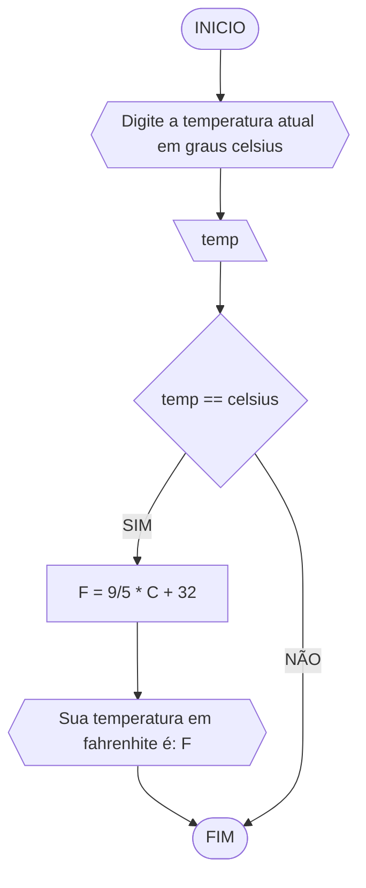

# UNIFOR
**Nome**: Ikaro Chaves <br>
**Disciplina**: Raciocínio Lógico Algorítmico

## Lista 2 
### Exercício 1
Calcule a média de quatro números inteiros dados

#### Fluxograma

#### Pseudocódigo

```
1  ALGORITIMO media_numeros
2  DECLARE N1, N2, N3, N4, M
3  INICIO
4  ESCREVA Digite quatro números inteiros
5  LEIA N1, N2, N3, N4
6  SE N1, N2, N3, N4 >= 0 ENTAO
7	  CALCULE M = N1+N2+N3+N4/4
8	  ESCREVA A média dos quatro números é: 
9  SENAO
10	  ESCREVA Digite quatro números inteiros
11  FIM_SE
12  FIM
  

```
### Exercício 2
Leia uma temperatura dada em Celsius (C) e imprima o equivalente em Fahrenheit (F). (Fórmula de conversão: F = (9/5) * C + 32)

#### Fluxograma

