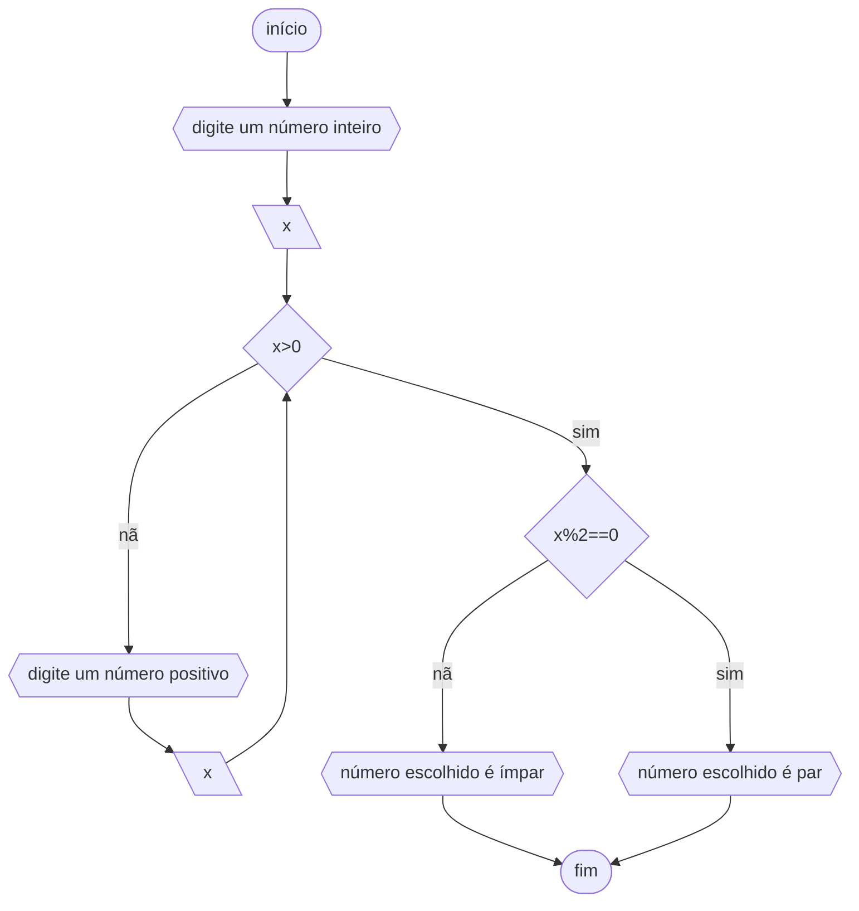
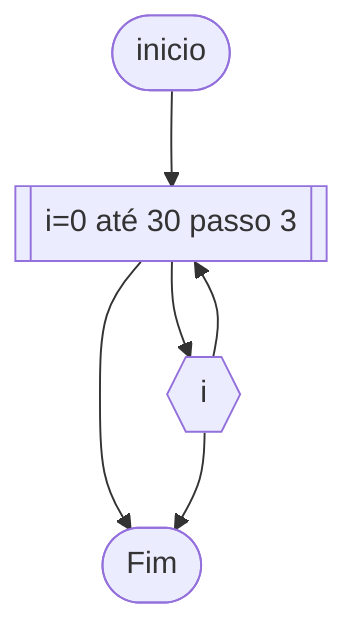
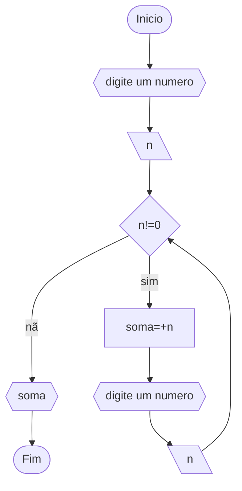
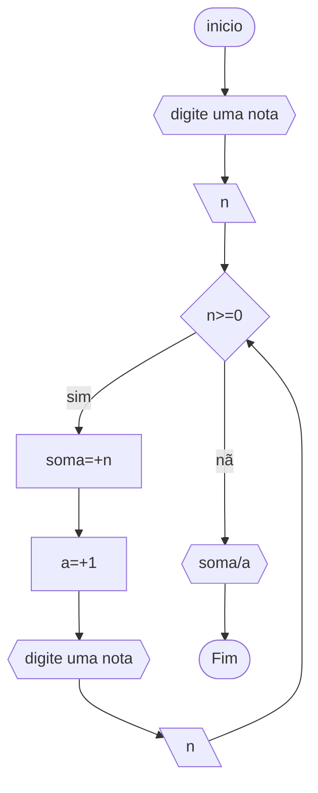

# UNIFOR
**Nome**: Ikaro Chaves <br>
**Disciplina**: Raciocínio Lógico Algorítmico

## Lista 2 
### Exercício 1
Atualize o algoritmo para determinar se um número inteiro e positivo é par ou ímpar, usando uma laço condicional para aceitar apenas números maiores ou iguais a zero. 

#### Fluxograma 1


#### Pseudocódigo 1
```
1  ALGORITIMO num_catg
2  DECLARE x NÚMERICO INTEIRO
3  ESCREVA "digite um número inteiro"
4  INICIO
5  SE x>0 ENTÃO 
6    SE X%2==0 ENTÃO
7    ESCREVA "número escolhido é par"
8    SENÃO
9    ESCREVA "número escolhido é ímpar"
10  SENÃO
11  ESCREVA "digite um número positivo"
12  LEIA x
13  FIM_SE
14  FIM_ALGORITMO

```
#### Teste de mesa 1
| entrada | negativo | positivo | impar | par | saida |
|--|--|--|--|--|--|
| 1 | nao | sim | sim | nao| impar|
| 2 |nao | sim | nao | sim| par|
| 12 |nao | sim | nao | sim| par|
| -1 | sim | nao |  | | numero negativo|

### Exercício 2
Faça um algoritmo que exiba na tela uma contagem de 0 até 30, exibindo apenas os múltiplos de 3.


#### Pseudocódigo 2
```
1  ALGORITMO multiplo
2  DECLARE i NÚMERICO INTEIRO
3  INICIO
4  i<--0
5  PARA i DE 1 ATÉ 30 PASSO 3 FAÇA
6  ESCREAVA i
7  FIM_PARA
8  FIM
```
#### Teste de mesa 2

0|3|6|9|12|15|18|21|24|27|30
|-|-|-|-|-|-|-|-|-|-|-|

### Exercício 3 
Dada uma sequência de números inteiros, calcular a sua soma. 
Por exemplo, para a sequência {12, 17, 4, -6, 8, 0}, o seu programa deve escrever o número 35.

#### Fluxograma 3

#### Pseudocódigo 3
```
1  ALGORITMO soma
2  DECLARE n, soma: NUMERICO
3  INICIO
4  ESCREVA "digite um numero"
5  LEIA n
6  soma<--0
7   	ENQUANTO (n!=0) FAÇA
8   		soma=+n
9   		ESCREVA "digite um numero"
10		LEIA n
11  FIM_ENQUANTO
12  ESCREVA soma
13  FIM
```
#### Teste de mesa 3

ordem|numero|n!=0|soma|saída
-|-|-|-|-
1|1|sim|1
2|2|sim|3
3|3|sim|6
4|4|sim|10
5|0|não|10|10

### Exercício 4
Escreva um programa que leia a nota de diversos alunos, até que seja digitada uma nota negativa. 
Nesse momento, ele mostra a média aritmética de todas as notas lidas e quantas notas foram lidas. 
Ex. Foram lidas 14 notas. A média aritmética é 6.75!

#### Fluxograma 4



#### Pseudocódigo 4
```
1  ALGORITMO media
2  DECLARE n, a, soma: NUMERICO
3  INICIO
4  soma <-- 0
5  a <-- 0
6  ESCREVA "digite uma nota"
7  LEIA n
8  	SE (n>=0) ENTÃO
9  		soma <-- +n
10		a <-- +1
11  		ESCREVA "digite uma nota"
12  		LEIA n
13  	SENÃO 
14  		ESCREVA soma/a
15  	FIM_SE 
16  FIM

```
#### Teste de mesa 4

nota | é >=0 | soma | a | saída
-|-|-|-|-
8|sim|8|1
7|sim|15|2
9|sim|24|3
5|sim|29|4
9|sim|38|5
-3|nao|38|5|7.6
